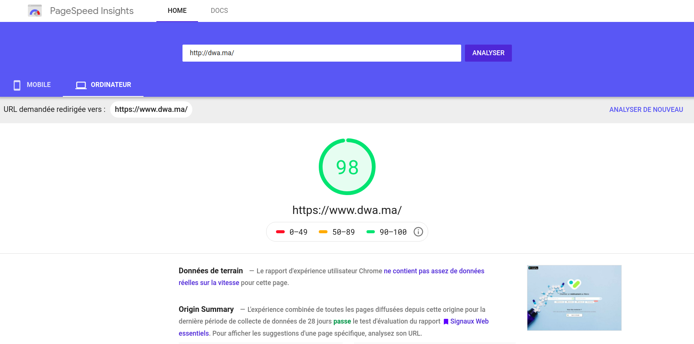

# Front end Engineer Challenge

## 1. About you

The project that I chose to share with you is this Database I created using Vue.Js: https://www.dwa.ma/.
It’s called DWA which means Medicine in Arabic and It’s the biggest Database for Moroccan Healthcare sector, collecting all types of medicines, labs, prices  and lately I added a prescription botton too.
I started last year, it took me 3 months to be done using Node.Js, express, mongodb on the server side and Vue.Js combined with Nuxt.Js for the server side rendering
This project was also the occasion for me to experience Elasticsearch, so DWA is using a search engine based on it.
This technology has been used to optimize the search engine as you can see below:

## 2. General

##### 2.1. What kind of front end projects do you enjoy working on? Why?
I spent the last 5 years developing with Angular and Vue JS I love these technologies. But Each time I start a new project I prefer Vue js this framework is fast easy to use and really straight forward. Angular in my opinion is more complicated but still more scalable and gives really solid way of working.
Either way Typescript is the next JS so all love putting it everywhere.  

##### 2.2. Which are your favorite features of HTML5? How have you used them before?

HTML5 features:
The attriutes placeholder, required, autofocu..
The semantic tagslike header, section, nav, foote..
The Drag and Drop api..

##### 2.3. Explain the difference between creating a DOM element setting `innerHTML` and using `createElement`.

Setting the innerHTML of a DOM element overrides any existing references to the elements inside this DOM element, so you are going to have to recreate those references. innerHTML also cancels existing event handlers to the inner elements.
createElement therefore is preferred in most cases: you can create an element and append it to the desired parent.

##### 2.4. Compare two-way data binding vs one-way data flow.

In two-way data binding, changing the model will change the view, and changing the view (for example changing an input value) will change the model. While in one-way data flow, changing the model changes the view, but changing the view does not change the model, so it should be done manually, for example through attaching an onChange event handler on the input and changing the model value accordingly.
The advantages of two-way data binding is that the developer doesn't have to add any setup to updated the model, it's taken care of (like in angular).
While the advantages of one-way data binding is that you have a single source of truth (The model), and the data flowing in a single direction is easier to understand and follow.

##### 2.5. Why is asynchronous programming important in JavaScript?

Javascript runs in a single thread, so we need asynchronous programming to go around this limitation. Javascript runs blocking code while waiting for asynchronous operations (eg. network calls) to return before handling them. This allows javascript to handle multiple requests concurrently while still running on a single thread.
